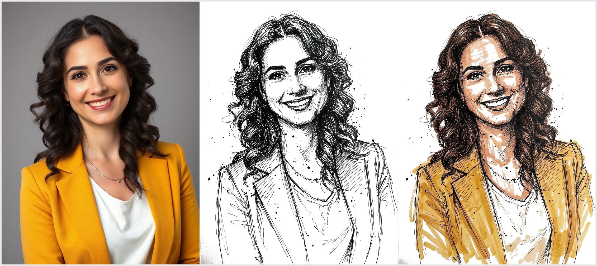

# dip-pen-sketch-outline — a Claude Code skill by [Reblis.com](https://reblis.com)

Turn any photo into a rough old-school **dip-pen, nib-and-India-ink line sketch** — pure black ink, no color:

```
dip-pen-sketch-outline /path/to/photo.jpg
```



*(The middle panel is what this skill produces. The right panel is the [color sibling](https://github.com/Reblis/dip-pen-sketch-color-skill).)*

The "Philly sketch" TikTok/CapCut look, ink-only: thin scratchy dip-pen strokes, built-up cross-hatching and stippling for shading, the odd ink splatter, the subject lifted onto blank sketchbook paper. Deliberately rough and unfinished — not a clean illustration.

## Install

```bash
git clone https://github.com/Reblis/dip-pen-sketch-outline-skill ~/.claude/skills/dip-pen-sketch-outline
```

Restart Claude Code (or start a new session) so the skill registers, then run it on any photo path or image URL.

## Requirements

This skill calls an AI image-editing model — it is **not** local/free:

- **[Claude Code](https://claude.com/claude-code)**
- **A connected [fal.ai](https://fal.ai) MCP server with credits.** The skill runs **`fal-ai/nano-banana-2/edit`** — Google's **Nano Banana 2** image-editing model, served through fal.ai. It's the part that preserves the subject's likeness while restyling. **Cost ≈ $0.03–0.04 per image.**
- `curl` and **ImageMagick** (`convert`) for fetching and resizing.
- *Optional, free:* a connected **nanobanana / Gemini MCP** runs the same Nano Banana model family at no cost — but its free tier is frequently rate-limited, which is why fal.ai is the default path.

## What you get

- **One image** — rough black-ink line sketch on blank white paper.
- **Background removed** — just the subject on empty paper.
- **Likeness preserved** — faces, expressions, hair, and clothing stay recognizable.
- **All-ink shading** — cross-hatching and stippling, no grey wash, no color.

## Related skills

- **[dip-pen-sketch-color](https://github.com/Reblis/dip-pen-sketch-color-skill)** — the same look with loose marker color.
- **[dip-pen-sketch-combo](https://github.com/Reblis/dip-pen-sketch-combo-skill)** — outputs both outline and color with stroke-for-stroke matching lines.

## Inputs

A local image path, a direct image URL, or — for Instagram/Facebook/Pinterest links (web pages, not images) — the skill downloads the photo first.

## Credit

Built by [Reblis.com](https://reblis.com). Uses Google's Nano Banana 2 via [fal.ai](https://fal.ai). MIT licensed.
